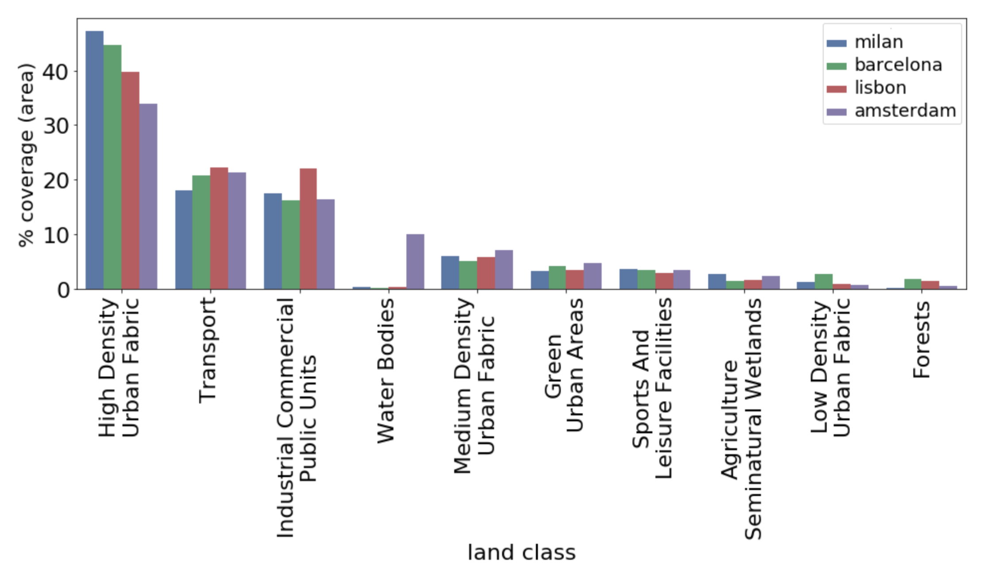

## Data pre-processing and experiments

To fetch, clean and prepare the data for the classifier we used [GeoL](https://github.com/gbarlacchi/geol) a library we developed to perform common pre-processing steps to prepare geographic data as input for machine learning tasks. Examples on how to use the library can be found in its repository. As with any regular python package it can be install through `pip`.

#### Data Download

* [Urban Atlas portal](https://land.copernicus.eu/local/urban-atlas/urban-atlas-2012). Free dataset but requires registration.

* [Foursquare Developer API](https://developer.foursquare.com/docs/api/getting-started). Free but it requires a registration and an API key. For convenience, the data can be retrieved using GeoL's crawler.

To easily scaffold the project structure we created the `dir-maker.py` python executable, which creates the directories structure while (optionally) unpacking the Urban Atlas compressed files.

We downloaded data and run experiments for different cities, but in the end focused on a smaller set which we found to be optimal in terms of similarity. These are:

* Lisbon
* Milan
* Amsterdam
* Barcelona

#### Fetching city shapes and creating the tessellations

In order to compare and train a classifier on the `UA` and `FS` data we need to relate them to the same spatial unit of analysis. This is done by creating a grid tessallation of equal-sized cells over each city's extension. We experimented with different cell sizes, ranging from 50m to 250m.

The tessellations can be created with GeoL's `create_grid.py` script as such:

```python
python GeoL/create_grid.py -a $CITY_NAME -b $OUTPUT_CITY_SHAPE -o $BASE_DIR_TESSELLATION  -v 2 -s $SIZE -m -t square
```

Note that the script doesn't require a shapefile in input to tessellate as it automatically can retrieve the administrative boundaries of a city through _OpenStreetMap's Nominatim API_. The polygon is digested as a `GeoPandas Dataframe`.

```python
>>> from geol.utils import utils
>>> city_shape = utils.get_area_boundary('Milan, Italy')
>>> city_shape.plot()
```

#### A note on pre-processing Urban Atlas data.

To the high number of classes in the dataset, and following [previous works](https://arxiv.org/abs/1704.02965), we aggregate some of the Urban Atlas land-use classes to a set of 10 consistent classes. This step can be found in the `pre_processing_ua.ipynb. The resulting land-use distribution can be seen in the following image:



#### Mapping and counting ground features to each tessellation cell

The actual mapping of ground features (e.g. Urban Atlas polygons and Foursquare POIs) to the tessellation cells is done through two distinct scripts.

The first script produces a `spatial join` (i.e. [a join based on the spatial location](http://wiki.gis.com/wiki/index.php/Spatial_Join)) between each cell and the corresponding features that it encompasses.

```python
python mapping.py -g $INPUT_DIR -d $FOURSQUARE_RAW_DATA -o $FOURSQUARE_TESSELLATION_NAME -n "latitude longitude"
```

The second script takes in input the mapped tessellation and produces a summary of the underlying features contained in each cell. For Foursquare data this simply means a straightforward count, while for Urban Atlas the script produces a percentage of land-use coverage for each class.

For instance, the following script will produce a summary for Foursquare data:

```python
python mapping.py -g $INPUT_DIR -d $FOURSQUARE_RAW_DATA -o $FOURSQUARE_TESSELLATION_NAME -n "latitude longitude"
```

These steps can be reproduced using the provided notebooks `pre_processing_fs.ipynb` and `pre_processing_ua.ipynb`.

#### Splitting Train and Test datasets and running the experiments

Finally, we aggregated the information derived from the Urban Atlas features with that from the Foursquare POIs, at each tessellation cell level. The data thus produces has been split in Train and Test datasets in the respective 80-20 proportion, and then fed as input for the classifier. These analysis steps can be found in the `train_test.ipynb` notebook.
